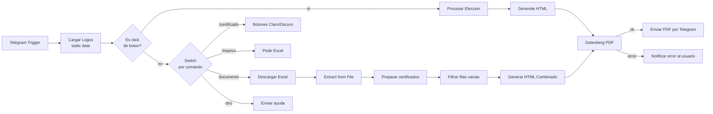

# Certificados DSC UTP — Telegram Bot + n8n

Bot de Telegram que genera certificados en PDF (individuales o en lote desde un Excel) para el Developer Student Club de la Universidad Tecnológica del Perú. Construido sobre **n8n** self-hosted en Docker, con **Gotenberg** para el render HTML→PDF y un túnel **ngrok** para exponer el webhook de Telegram.


## Cómo funciona

El usuario escribe comandos al bot. El workflow decide entre generar **un certificado individual** o procesar un **Excel con varios participantes**, en ambos casos delegando el render del PDF a un servicio Gotenberg propio (sin depender de APIs externas de pago).



**Comandos del bot:**
- `/certificado <nombre>` → pregunta tema (☀️ claro / 🌙 oscuro) y genera un PDF individual.
- `/masivo` → pide un Excel (columnas `Nombres`, `Apellidos`, `Tema`) y genera **un solo PDF multipágina** con todos los certificados, evitando N llamadas separadas a la API de Telegram.

## Stack

| Componente | Rol |
|---|---|
| [n8n](https://n8n.io) | Orquestación del flujo (self-hosted, Docker) |
| [Gotenberg](https://gotenberg.dev) | Conversión HTML → PDF vía Chromium headless |
| [ngrok](https://ngrok.com) | Túnel HTTPS con dominio fijo para el webhook de Telegram |
| Telegram Bot API | Interfaz conversacional |

## Setup

1. Clona el repo y crea tu `.env` a partir del ejemplo:
   ```bash
   cp .env.example .env
   ```
2. Completa `.env` con:
   - Un dominio estático de ngrok ([dashboard.ngrok.com/domains](https://dashboard.ngrok.com/domains))
   - Tu `NGROK_AUTHTOKEN`
3. Levanta el stack:
   ```bash
   docker compose up -d
   ```
4. Entra a n8n (`https://tu-dominio.ngrok-free.dev`), crea la credencial de Telegram (`Bot Certificado` en este proyecto) con el token de [@BotFather](https://t.me/BotFather).
5. Importa el workflow desde [`workflows/certificados-gotemberg.json`](workflows/certificados-gotemberg.json) y actívalo.

## Diseño y decisiones de ingeniería

Este workflow pasó por una revisión de código como si fuera producción real, no solo un flujo de demo:

- **Bug de datos corregido**: el `callback_data` de los botones inline llevaba un `=` duplicado (mezcla entre el marcador de expresión de n8n y el valor literal), lo que obligaba a un parche río abajo (`.replace('=', '')`). Se corrigió en el origen.
- **DRY en el logo/plantilla**: el logo en base64 (~24 KB) estaba duplicado 4 veces entre los dos generadores de HTML (individual y por lote), y las plantillas ya habían empezado a divergir visualmente (sombras, posición del footer). Ahora los logos se cargan **una sola vez** en `Cargar Logos` usando el *static data* del workflow (`$getWorkflowStaticData`), y ambas plantillas quedaron alineadas.
- **Manejo de errores en el paso crítico**: la llamada a Gotenberg (conversión a PDF) tiene reintentos automáticos (3 intentos) y, si falla de todas formas, el usuario recibe un mensaje de error en Telegram en vez de quedarse sin respuesta.
- **Validación de datos del Excel**: se agregó un filtro que descarta filas sin nombre antes de generar certificados en el modo `/masivo`, evitando páginas en blanco por filas vacías o mal formateadas.
- **Validación del comando `/certificado`**: si el usuario envía el comando sin nombre (`.replace('/certificado ', '')` no encontraba coincidencia sin el espacio final), el bot generaba un certificado con el nombre literal `"/certificado"`. Se corrigió la extracción del texto y se agregó un nodo `¿Tiene Nombre?` que le pide el nombre al usuario en vez de generar un PDF con datos basura.

### Mejoras futuras (documentadas, no implementadas aún)

- **Lista blanca de usuarios**: hoy cualquier persona que encuentre el bot puede disparar generación de certificados. Se recomienda validar `chatId`/`username` contra una lista permitida.
- **Exponer solo el webhook, no todo n8n**: actualmente el túnel ngrok expone el editor completo de n8n; en producción convendría limitar el túnel solo a la ruta del webhook o añadir autenticación adicional.
- **Sub-workflow reutilizable**: extraer la construcción del HTML del certificado a un sub-workflow (`Execute Sub-workflow`) para eliminar por completo la duplicación de plantilla entre el flujo individual y el masivo (hoy reducida, pero aún son dos funciones separadas).
- **Chunking en lotes grandes**: para Excels muy grandes, trocear la generación en tandas para no acercarse a los límites de tamaño de Gotenberg/Telegram.

## Estructura del repo

```
.
├── docker-compose.yml       # n8n + ngrok + gotenberg
├── .env.example             # variables de entorno (sin secretos)
└── workflows/
    └── certificados-gotemberg.json   # export del workflow de n8n
```

## Licencia

MIT
